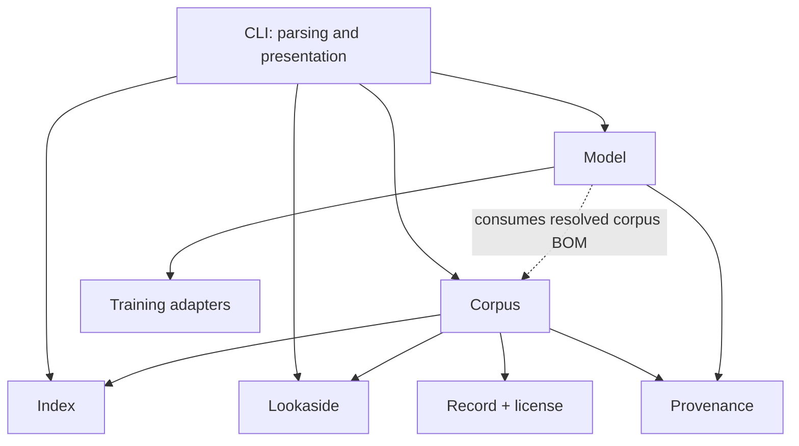

# System Architecture

WALDO is one Go binary with bounded domains. The binary is the distribution and
user-experience boundary; it is not one undifferentiated subsystem.

Dependencies point from model workflows toward the corpus contract. Index,
record, lookaside, and corpus packages never import model or training code.

## Domain ownership

### Index

Owns schemas, canonical metadata encoding, traversal, inheritance, structural
verification, summaries, generated navigation, and Git revision identity. It
does not read model state or run trainers.

### Record and shard

Owns canonical document identity and representation, license normalization,
Parquet decoding, local audit, and JSONL interchange. These facts are not
duplicated in fetchers or framework workers.

### Lookaside

Owns verified object transport, cache/scratch lifecycles, reachability probes,
mirrors, S3/file publication, credential access, inventory, and explicit
deletion. It moves bytes but assigns no provenance meaning to a URL.

### Corpus

Owns ingestion, deterministic packing, recursive selection, license policy,
materialization, export, and corpus BOM construction. The BOM is its central
output and the normal data boundary into models.

### Provenance

Owns serialization and verification of corpus exports, training run records,
model lineage, and disclosure projections. These remain related records rather
than one giant optional schema.

### Model

Owns architecture, origins, composes, lifecycle transactions, forecast, lineage,
inference selection, and release export. It does not traverse index metadata or
choose mirrors itself.

### Training

Owns a narrow execution adapter. It receives an explicit request and returns
observations. Framework-specific workers do not own durable model state or BOM
persistence.

## Implementation properties

- Durable writes use temporary files plus atomic rename.
- Large-object paths stream rather than loading whole corpora/models in memory.
- Network access is explicit and replaceable in tests.
- Persistent formats carry `kind` and `schema`.
- Errors retain the relevant path, hash, source, or run identity.
- Interfaces live near the consumer that needs them.

The code lives under `cmd/waldo` and `internal/*`; tests combine unit, E2E, and
opt-in live integrations. Architectural decisions are captured as numbered ADRs
in the WALDO source repository.

