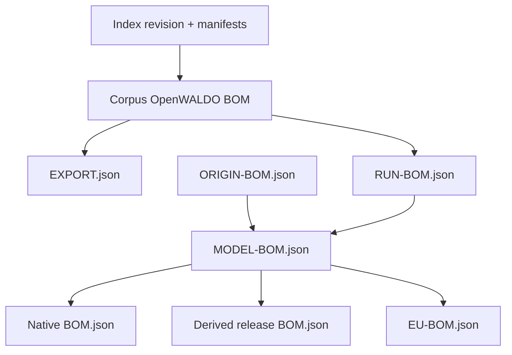

# BOMs and Provenance

WALDO uses several related Bills of Materials because corpus selection, run
planning, observed execution, aggregate lineage, and release inventory answer
different questions.

## Corpus OpenWALDO BOM

The resolved data handoff includes:

- index remote, commit, and dirty state;
- sorted requested paths and license policy;
- manifest hashes and resolved corpus facts;
- verified submanifest nodes when present;
- ordered self-contained shard pins;
- sources, conversion recipes, licenses, modalities, and exact totals.

It contains resolved values, not mutable manifest pointers or instructions to
consult machine configuration.

## `EXPORT.json`

A corpus export is a `waldo-corpus-export` schema-1 envelope. Its nested BOM
identifies corpus meaning; its outer fields record generation time, output
format, and every materialized file. Native files preserve object identity;
derived JSONL entries record both source-object and output-file hashes.

## `ORIGIN-BOM.json`

A pulled model origin pins the provider repository, requested reference,
resolved immutable revision, declared license when available, and every acquired
artifact hash. Managed normalized weights are retained; temporary provider
downloads are not duplicated.

## `RUN-BOM.json` and `RUN.json`

The run BOM binds architecture, corpus BOM, optional starting origin, backend,
objective, resolved parameters, environment, evaluation selection, and planned
work before execution. `RUN.json` records attempts, state transitions, and
observations such as consumed tokens, losses, and output hashes.

## `MODEL-BOM.json`

The managed aggregate is append-only. It retains origin and run identities,
terminal states, backend/simulation facts, observations, and artifact hashes.
`current_origin_sha256` selects pulled weights until a complete real run becomes
`current_run_id`. Failed, interrupted, and simulated history is not erased.

## Release `BOM.json`

A native WALDO export renames the complete aggregate to `BOM.json` and keeps the
run tree. A derived format uses a compact `model-release` BOM containing format,
model identity, selected source/run, `source_bom_sha256`, and every artifact
path/hash/size. The source hash detects substitution but cannot recreate an
unpublished source BOM.

## `EU-BOM.json`

The EU projection combines provider configuration, model lineage, and corpus
evidence against a pinned template version. It is not a second weight inventory,
does not replace technical provenance, and is not by itself proof of compliance.

