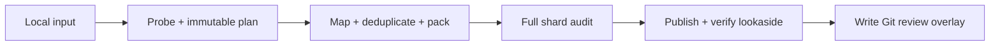

# Ingest a Corpus

Ingestion turns independently acquired files into canonical objects and a
small review overlay. Large bytes go to lookaside storage; meaning goes to Git.



## Direct input

```console
$ waldo index ingest ./input /path/to/waldo-index/category/name \
    --title "Corpus title" \
    --description "What this corpus contains." \
    --license CC-BY-4.0 \
    --source https://example.org/source \
    --source-category public-dataset \
    --dry-run
```

Title, license, source URL, and source category are required. `--source-name`
sets a label, `--text-column` resolves ambiguous Parquet, and `--input-profile`
maps structured records. Never skip dry-run for a consequential corpus.

Supported physical inputs include text/Markdown files, JSONL (plain, gzip, or
zstd), and Parquet. Input profiles additionally support record maps, dialogue
pairs, ranked conversation trees, bounded text, and a deliberately limited XML
record mapping.

## Reviewed recipes

A strict recipe can run external acquisition scripts before the same pipeline:

```yaml
kind: waldo-ingest-recipe
schema: 1
title: Example corpus
description: Material acquired from the example project.
license: CC-BY-4.0
source:
  name: example
  url: https://example.org/data
  category: public-dataset
steps:
  - name: fetch
    exec: ./fetch.sh
    args: ["--stable"]
```

```console
$ waldo index ingest ./recipes/example.yaml /path/to/waldo-index/category/example --dry-run
$ waldo index ingest ./recipes/example.yaml /path/to/waldo-index/category/example
```

Recipe execution is explicit trust, not an OS sandbox. Commands run directly,
sequentially, with the user's permissions and environment. They share a private
working directory exposed as `WALDO_FETCH_DIR`. WALDO pins recipe and executable
hashes, rechecks them after execution, probes only regular non-symlink outputs,
and owns everything from conversion onward.

Recipes own corpus metadata and reject metadata flags. Fetchers never mutate an
index, upload objects, or train models. A logical destination is valid when the
current directory is already inside its checkout; otherwise pass an absolute or
`./` destination so WALDO can discover the checkout.

## Failure and recovery

Ingestion journals verified progress below `ingest.staging`. Completed shard
uploads are remotely verified before local staged copies are purged. An
unchanged retry reuses safe preparation state; changed inputs create a different
plan. The contribution overlay is written only after every referenced remote
object is verified.

Review the diff, verify the new path, stage only the printed overlay, and commit
with DCO sign-off. The checkout is unchanged when ingestion finishes: inspect
the contribution root printed by WALDO, then explicitly copy its contents over
the checkout before reviewing the Git diff.
