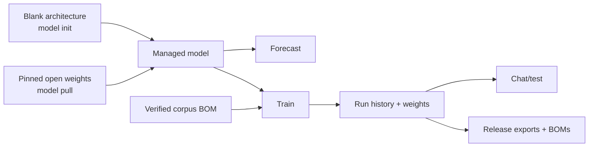

# Model Lifecycle

WALDO models combine immutable architecture with append-only origin and training
history. Data provenance reaches the model through a resolved corpus BOM rather
than through an unexplained directory of files.



## Start blank

```console
$ waldo model init small --preset 10m
$ waldo model list 'small*'
$ waldo model summary small
```

Available presets are `10m`, `35m`, `90m`, `300m`, `1b`, `3b`, `7b`, `13b`,
`34b`, and `70b`. Initialization writes architecture but no trained weights.

## Start from open weights

```console
$ waldo model pull llama-base huggingface://organization/model@main
```

WALDO resolves the requested Hugging Face reference to an immutable repository
revision, hashes acquired artifacts, validates the configuration/tokenizer/
tensor contract, and losslessly normalizes compatible Safetensors names. An
`ORIGIN-BOM.json` preserves provider, requested reference, resolved commit,
declared license, and artifact hashes.

The current schema supports standard bias-free Llama weights using the
OpenWALDO byte tokenizer (vocabulary 259) and F32, F16, or BF16 tensors. Gated
repositories use `HF_TOKEN` or the standard Hugging Face token file. Unsupported
architectures or tokenizers fail before publication.

## Forecast before training

```console
$ waldo model forecast core/books
$ waldo model forecast ./compose.yaml
```

For corpus paths, forecast recommends a model rung using roughly 20 tokens per
parameter and estimates one pass. For a compose, it uses the declared
architecture and full budget. Only configurations that fit are shown.
Completed real runs calibrate estimates only for the exact accelerator and GPU
count observed; other rows retain the versioned catalog assumptions. Forecast
creates no model state.

## Train and inspect

```console
$ waldo model train small core/books --epochs 1
$ waldo model summary small
$ waldo model bom small ./small-bom.json
```

Training resolves and de-duplicates selections, materializes and audits
hash-verified Parquet, derives an exact model-token budget, writes a planned run,
then executes the backend. One percent of records—capped at 256 records and
1 MiB—is deterministically held out and pinned for real loss/perplexity
evaluation. A one-record corpus has no holdout.

The built-in compact profile uses batch size 8, architecture context length,
learning rate 0.0003, seed 42, and one epoch by default. Exact low-level or
multi-stage control belongs in a compose.

## Generate

```console
$ waldo model chat small
$ waldo model chat small "Once upon a time"
$ waldo --json model chat small "Once" --temperature 0 --seed 7
```

Interactive mode supports `/clear`, `/help`, and `/exit`. Current generation
requires a compatible MLX runtime. Built-in models are raw causal continuation
models with no chat template, so they should not be expected to behave like
instruction-tuned assistants.

## Remove

```console
$ waldo model rm small
```

Removal accepts exact managed names only. Paths and globs are rejected, and all
names are preflighted before anything is removed.

