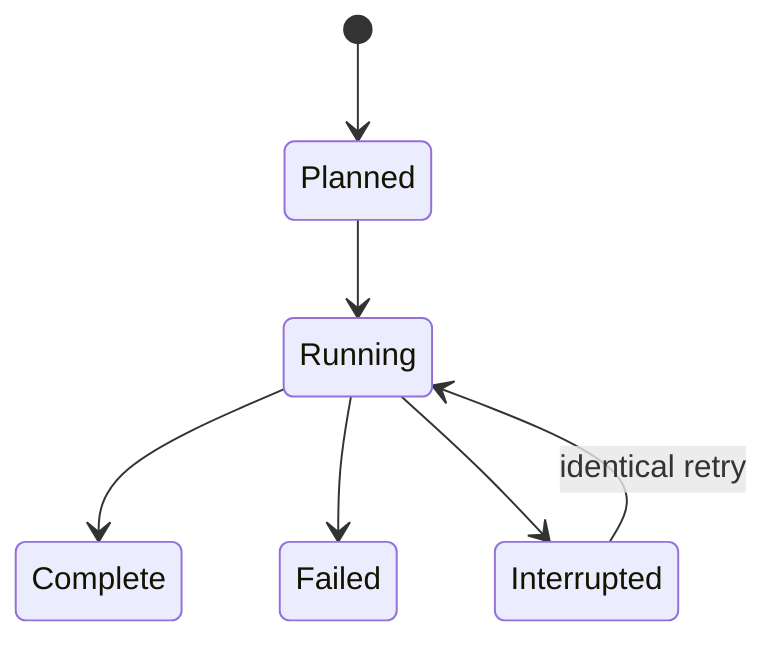

# Composes and Training

A model compose is a portable, strict YAML or JSON plan for architecture and
ordered training stages. It never names the machine-local training framework.

## Compose example

```yaml
kind: waldo-model-compose
schema: 1

# Optional: continue from a managed pulled model.
base:
  model: llama-base
  origin_sha256: 0123456789abcdef0123456789abcdef0123456789abcdef0123456789abcdef

architecture:
  family: decoder-transformer
  context_tokens: 2048
  vocabulary_size: 259
  hidden_size: 384
  intermediate_size: 1024
  layers: 6
  attention_heads: 6
  key_value_heads: 2
  tie_embeddings: true
  parameter_dtype: bfloat16
  tokenizer:
    name: byte
    revision: builtin-byte-schema-1

stages:
  - name: pretrain
    type: pre-training
    objective: causal-language-modeling
    corpora: [core/books, science/plos]
    parameters:
      profile: causal-pretrain-v1
      steps: 10000
      batch_size: 2
      sequence_length: 1024
      learning_rate: 0.0003
      seed: 7
      weight_decay: 0.1
      warmup_steps: 100
      checkpoint_every: 500
      evaluate_every: 500
```

```console
$ waldo model forecast ./compose.yaml
$ waldo model compose my-model ./compose.yaml
```

The command name supplies local identity, keeping the compose reusable. WALDO
preflights every stage before publishing the model. A base model's origin hash
and architecture must match exactly.

Existing names are refused. `--replace` uses a durable content-identified
transaction: the old model remains published until every replacement stage is
complete, and an identical retry resumes interrupted work.

## Backend selection

`model.backend=auto` chooses by host:

- Apple Silicon macOS: a usable MLX Python environment.
- Linux: usable TorchTitan first, then PyTorch.
- Other or unusable environments: fail with installation guidance.

Explicit values are `mlx`, `torchtitan`, `pytorch`, and `fake`. The fake backend
is simulation for tests and development only; its artifacts are permanently
marked simulated. It is never selected automatically and cannot become a real
release source.

WALDO proves a real operation on the selected device before creating a run.
TorchTitan additionally checks every visible GPU and required distributed APIs,
then runs one rank per GPU on a single Linux node.

## Durable run state



The immutable run BOM is written before the backend starts. Runtime status and
observations are separate, preventing the plan from being rewritten after the
fact. Exactly one terminal state is persisted.

Real checkpoints atomically bundle weights, optimizer state, runtime random
state, step, and token position. Repeating the exact command after interruption
verifies the bundle and backend revision, replays deterministic input to the
saved point without optimization, and records a new attempt. Changed corpus,
parameters, profile, backend, or environment creates a new run.

## Data delivery boundary

Training adapters do not parse indexes or Parquet. WALDO resolves a named
training profile and streams deterministically shuffled canonical records over
a versioned NDJSON worker protocol. This keeps selection, license policy,
ordering, packing, and provenance owned by WALDO rather than reimplemented in
each framework.

## Current objective boundary

WALDO currently performs causal language-model pre-training or continued
pre-training. Supervised fine-tuning and preference tuning require distinct
record contracts, objectives, evaluation, and chat-template provenance and are
not inferred from ordinary text.

