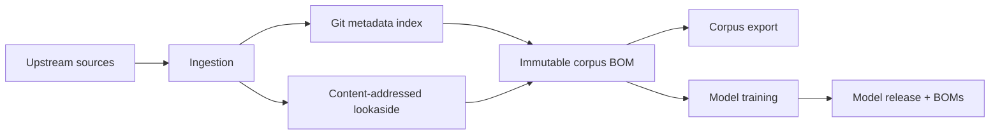

# Introduction

AI models are often distributed without a precise, inspectable account of the
material used to build them. OpenWALDO treats training material as source: it
should be named, versioned, reviewable, attributable, content-addressed, and
removable.

OpenWALDO joins three deliberately separate systems:

1. A Git-governed **index** records corpus meaning, sources, asserted licenses,
   counts, conversion identity, and object hashes.
2. Federated **lookaside storage** serves large canonical Parquet objects by
   their SHA-256 identity.
3. The **WALDO CLI** verifies, ingests, exports, and carries the resolved data
   provenance into model runs and releases.

The result is not a claim that a hash proves legal rights, model safety, or
regulatory compliance. It is a chain of specific, attributable, falsifiable
facts: what was selected, what bytes were verified, what a training backend
reported, and what artifacts were released.

## Choose a path

- To inspect or use public data, begin with the [consumer quickstart](getting-started/consumer-quickstart.md).
- To add data, begin with the [contributor quickstart](getting-started/contributor-quickstart.md).
- To understand the whole system with only local files, follow the [local walkthrough](getting-started/local-walkthrough.md).
- To train or continue a model, read the [model lifecycle](guides/models.md).

## What the first useful release covers

WALDO can read and verify the public index, materialize hash-verified shards,
export selections with a BOM, ingest canonical text data, build and continue
small decoder models through real backends, preserve run history, and export
several model package formats. Supervised fine-tuning, preference tuning,
frontier-scale orchestration, and remote index APIs are outside the current
implemented scope.

