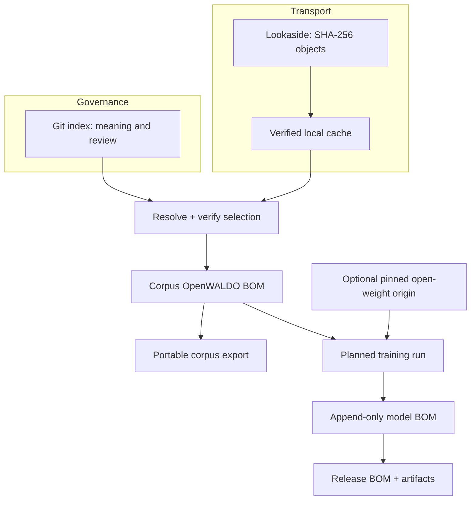

# The Mental Model

Most WALDO workflows become simple once four nouns are kept separate.

## Index: meaning

The index is a small Git tree. Directory indexes navigate to corpus manifests;
manifests declare title, source evidence, asserted license, conversion identity,
counts, and canonical object hashes. Git provides review and revision history.

## Lookaside: bytes

Large objects do not belong in Git. Lookaside storage contains canonical
Parquet bytes addressed by SHA-256. It does not decide what those bytes mean.
The same object can be mirrored without changing its identity.

## BOM: resolved handoff

An OpenWALDO BOM is the immutable result of resolving a selection. It pins the
index identity, requested paths, manifest hashes, license policy, sources,
shards, and exact totals. Downstream model code consumes this resolved record;
it does not reinterpret a mutable index.

## Model: lineage

A model has immutable architecture plus append-only origin and run history.
Training records a plan before execution and observations afterward. A release
selects verified weights and inventories every exported artifact.

## A useful rule

Configuration describes this machine—paths, credentials, caches, and backend
preferences. It never describes corpus meaning. Corpus facts belong in reviewed
index metadata and BOMs.

