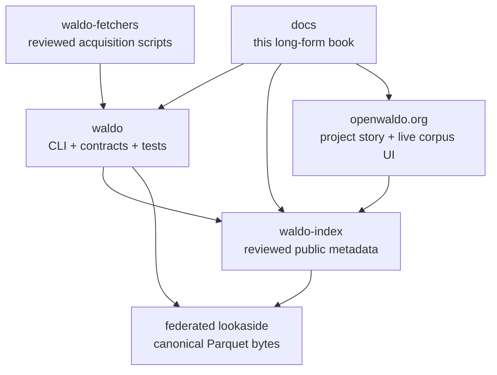

# Repository Map

OpenWALDO separates presentation, implementation, metadata governance, and
large bytes.

## `waldo`

The Go implementation, CLI help, behavioral contracts, ADRs, and tests.
`cmd/waldo` is the process entry point; bounded domains live under `internal/`.
The source repository is authoritative for implemented behavior.

## `waldo-index`

The public Git metadata commons. Category directories lead to 20 corpus
manifests in the current snapshot. A workflow generates `status.json` from the
tree for public status consumers. Large shards are referenced, not committed.

## `openwaldo.org`

The dependency-free static project website. It explains the thesis, public
corpus, training, contribution, FAQ, and community. Its live corpus record loads
the aggregate feed published from `waldo-index`, with a local snapshot fallback.

## `waldo-fetchers`

Source-specific shell acquisition scripts and strict ingest recipes. Scripts
end after placing acquired artifacts in WALDO-owned temporary input. They do
not own canonical conversion, lookaside publication, index mutation, or models.

## `docs`

This task-oriented and conceptual book. It translates contracts and behavior
across the other repositories into one learning path. When documentation and
code disagree, treat shipped CLI help and tested source contracts as
authoritative and update the book.

## Lookaside infrastructure

Object hosting is intentionally federated and outside metadata governance.
Operators can mirror bytes without taking ownership of source/license meaning.

